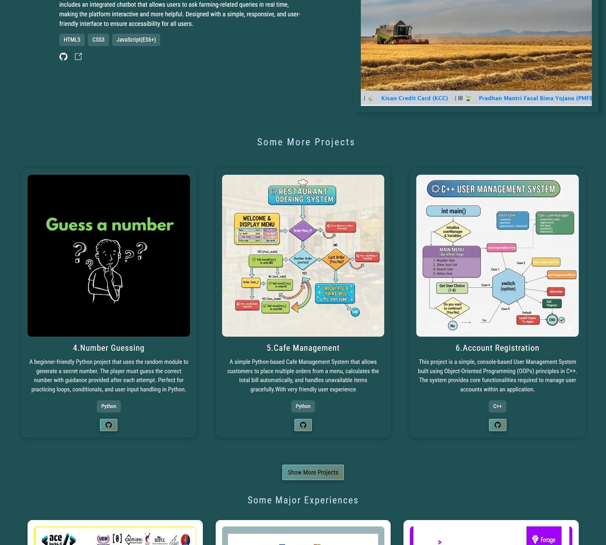

## Hii, welcome to this repo
---


## Some layouts and dimensions of the repo


---

[](https://reactjs.org/) 
[](https://vitejs.dev/) 
[](https://developer.mozilla.org/en-US/docs/Web/JavaScript)
[](https://portfolio-nd4r.vercel.app)


## Table of Contents
- [About the Project](#about-the-project)
- [Demo](#demo)
- [Features](#features)
- [Technologies Used](#technologies-used)
- [Installation](#installation)

---

## About the Project
This is **Bittu's personal portfolio website**, showcasing web development projects, skills, and achievements.  
It is designed to be **responsive, interactive, and visually appealing**, reflecting my journey and growth as a front-end developer.  

---

## Demo

Live Site: [🌐 https://portfolio-nd4r.vercel.app](https://portfolio-nd4r.vercel.app)

---

## Features
- Modern and clean design
- Fully responsive layout for mobile, tablet, and desktop
- Interactive project and image components
- About section highlighting skills and interests
- Smooth scrolling navigation
- Easy deployment with Vercel

---

## Technologies Used
- **Frontend:** React, Vite, JavaScript, HTML, CSS  
- **Styling:** CSS Modules, Tailwind
- **Deployment:** Vercel  

---


# Portfolio Overview



---


## Installation
To run the project locally:

```bash
# Clone the repository
git clone https://github.com/your-username/portfolio.git

# Navigate to project folder
cd portfolio

# Install dependencies
npm install

# Run development server
npm run dev
